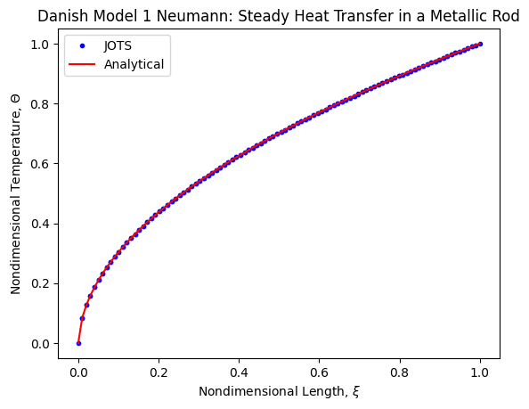

# Steady Heat Transfer in a Metallic Rod - Neumann Variation

This test case is a variation (using a Neumann BC) of the one outlined in Section II of Danish, Mohammad & Kumar, Shashi. (2011). Exact Solutions of Three Nonlinear Heat Transfer Problems. Engineering Letters. 19. 255-260. 

$\Theta'(1)=26/51$

$k(1)=51$

$q=51*(26/51)=26$

