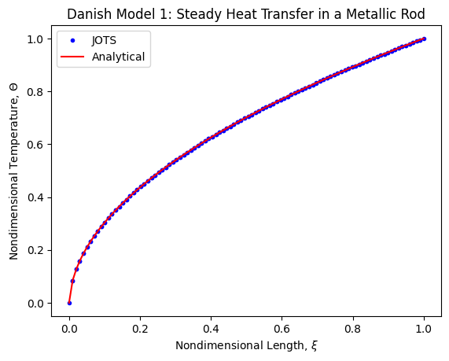

# Steady Heat Transfer in a Metallic Rod

This test case is equivalent to the one outlined in Section II of Danish, Mohammad & Kumar, Shashi. (2011). Exact Solutions of Three Nonlinear Heat Transfer Problems. Engineering Letters. 19. 255-260. 

