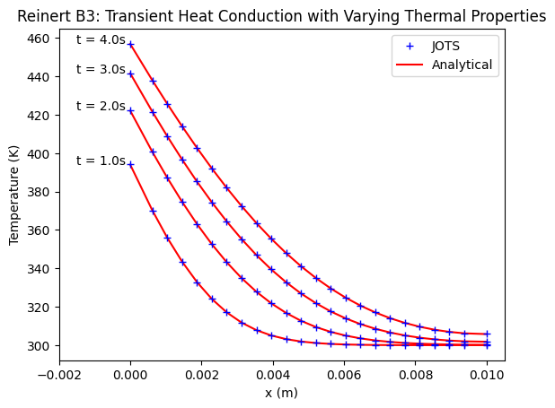

# Transient Heat Conduction with Variable Thermal Properties

This test case is equivalent to the one outlined in Section B.3 of John D. Reinert, Anubhav Dwivedi, and Graham V. Candler. "Verification of a conjugate heat transfer tool with US3D". AIAA SciTech 2019.

